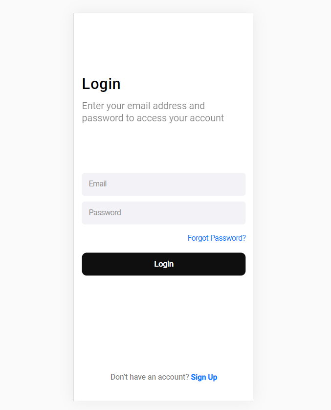

# Login Screen

### Here is a visual example of the project.

> This was a project developed using HTML and CSS taken from a design submitted by Figma. A login screen project developed for mobile. 

### 🚀 Adjustments and improvements

The project, despite being visually finished, can still count on improvements, such as:

- Inclusion of active links
- Responsiveness for larger screens
- Visual effect on the button

### 💻 Technologies used
In this project, parameters were extracted from Figma, and used HTML and CSS, namely:  
<code></code><b>39%</b>  
<code></code><b>61%</b>

## 🤝 Contributors

We thank the following people who contributed to this project:

<table>
  <tr>
    <td align="center">
      <a href="https://github.com/Guartieri">
         
        
          <b>Vinícius Guartieri</b>
        
      </a>
    </td>
  </tr>
</table>

### 💬 Contact us
 For suggestions or questions, contact us through:
 

  
  
    
